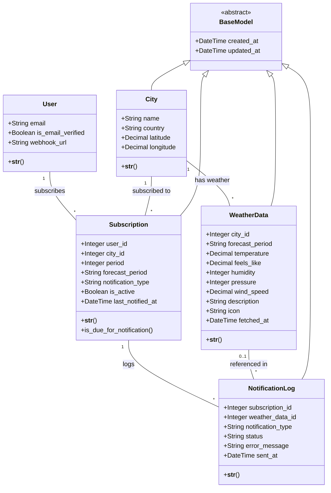

# DjangoWeatherReminder — Implementation Plan

## Project Overview

**DjangoWeatherReminder** — weather notification service with city subscriptions.

| Component         | Technology                                                   |
| ----------------- | ------------------------------------------------------------ |
| Backend           | Python 3.12+, Django 5.x, DRF                                |
| Database          | PostgreSQL 16                                                |
| Cache/Broker      | Redis                                                        |
| Task Queue        | Celery + Celery Beat                                         |
| Auth              | JWT (djangorestframework-simplejwt) + OAuth (Google, GitHub) |
| Frontend          | Webpack, Tailwind CSS, ES6 Modules                           |
| Weather API       | OpenWeatherMap (Free tier)                                   |
| Package Manager   | UV (Python), npm (Node.js)                                   |
| Container         | Docker + Docker Compose                                      |
| Development Tools | django-debug-toolbar (dev only)                              |

---

## Architecture Overview

```
Client Layer (Web/Mobile/Third-party)
         │
         ▼ HTTP/REST
Django REST API (Auth, Subscriptions, Weather)
         │
    ┌────┼────┐
    ▼    ▼    ▼
PostgreSQL  Redis  Celery Beat
              │      │
              └──┬───┘
                 ▼
            Celery Workers
                 │
         ┌───────┼───────┐
         ▼       ▼       ▼
    Weather API  Email  Webhooks
```

---

## Project Structure

```
weather_reminder/
├── src/
│   ├── config/              # Django settings, urls, celery
│   ├── app/                 # Main application
│   │   ├── models.py        # All models
│   │   ├── serializers.py   # DRF serializers
│   │   ├── views.py         # API views
│   │   ├── urls.py          # URL routing
│   │   ├── admin.py         # Admin configuration
│   │   ├── tasks.py         # Celery tasks
│   │   └── services/        # Business logic
│   │       ├── city_service.py
│   │       ├── weather_service.py
│   │       └── notification_service.py
│   ├── templates/           # HTML templates
│   └── manage.py
├── frontend/                # Frontend build system
│   ├── src/
│   │   ├── js/              # JavaScript modules
│   │   └── css/             # Tailwind CSS
│   └── dist/                # Compiled assets
├── tests/                   # Pytest tests
├── docker/                  # Docker files
├── docker-compose.yml
├── pyproject.toml
└── package.json
```

---

## Data Models

### 1. User (extends AbstractUser)

- `email` (unique, USERNAME_FIELD)
- `is_email_verified`
- `webhook_url` (nullable)

### 2. City

- `name`, `country`
- `latitude`, `longitude`
- `unique_together: [name, country]`

### 3. Subscription

- `user` (FK → User)
- `city` (FK → City)
- `period` (choices: 1, 3, 6, 12 hours) - Notification frequency
- `forecast_period` (choices: current, today, tomorrow, 3days, week) - Forecast period for notifications
- `notification_type` (choices: email, webhook, both)
- `is_active`
- `last_notified_at` (nullable)
- `unique_together: [user, city]`

### 4. WeatherData

- `city` (FK → City)
- `forecast_period` (choices: current, today, tomorrow, 3days, week, hourly) - Period of forecast
- `temperature`, `feels_like`, `humidity`, `pressure`
- `wind_speed`, `description`, `icon`
- `fetched_at`
- `Meta: unique_together: [city, forecast_period]` - One record per city and period

### 5. NotificationLog

- `subscription` (FK → Subscription)
- `weather_data` (FK → WeatherData, nullable)
- `notification_type` (email, webhook)
- `status` (pending, sent, failed)
- `error_message` (blank)
- `sent_at` (nullable)

### 6. BaseModel (Abstract)

- `created_at` (auto_now_add)
- `updated_at` (auto_now)

**Note:** All models inherit from BaseModel except User (AbstractUser already has timestamps).

---

## Database Schema

### ER Diagram (Mermaid)



### Model Descriptions

#### 1. User (extends AbstractUser)

Custom user model with email-based authentication.

- **email**: Primary identifier (unique, USERNAME_FIELD). Uses Django email validators.
- **is_email_verified**: Flag indicating if email is verified.
- **webhook_url**: Optional URL for webhook notifications (nullable).
- \***\*str**()\*\*: Returns email address.

**Note:** Inherits standard Django AbstractUser fields (username, password, first_name, last_name, is_staff, is_active, date_joined, last_login).

#### 2. City

Geographic location for weather subscriptions.

- **name**: City name (CharField, max_length=100).
- **country**: Country name (CharField, max_length=100).
- **latitude**: Geographic latitude (DecimalField, max_digits=9, decimal_places=6).
- **longitude**: Geographic longitude (DecimalField, max_digits=9, decimal_places=6).
- \***\*str**()\*\*: Returns "name, country".
- **Meta: unique_together**: `[name, country]` - Prevents duplicate cities.

**Inherits from BaseModel:** `created_at`, `updated_at`.

#### 3. Subscription

User's subscription to weather notifications for a specific city.

- **user**: ForeignKey to User (`related_name="subscriptions"`).
- **city**: ForeignKey to City (`related_name="subscriptions"`).
- **period**: Notification frequency in hours (IntegerField, choices: 1, 3, 6, 12).
- **forecast_period**: Forecast period for notifications (CharField, choices: current, today, tomorrow, 3days, week).
- **notification_type**: How to send notifications (CharField, choices: email, webhook, both).
- **is_active**: Whether subscription is active (BooleanField, default=True).
- **last_notified_at**: Timestamp of last notification sent (DateTimeField, nullable).
- \***\*str**()\*\*: Returns "user.email - city.name".
- **is_due_for_notification()**: Checks if notification should be sent based on `period` and `last_notified_at`.
- **Meta: unique_together**: `[user, city]` - One subscription per user per city.

**Inherits from BaseModel:** `created_at`, `updated_at`.

#### 4. WeatherData

Cached weather information for a city and forecast period.

- **city**: ForeignKey to City (`related_name="weather_data"`).
- **forecast_period**: Period of forecast (CharField, choices: current, today, tomorrow, 3days, week, hourly).
- **temperature**: Temperature in Celsius (DecimalField, max_digits=5, decimal_places=2).
- **feels_like**: Feels-like temperature (DecimalField, max_digits=5, decimal_places=2).
- **humidity**: Humidity percentage (IntegerField).
- **pressure**: Atmospheric pressure in hPa (IntegerField).
- **wind_speed**: Wind speed in m/s (DecimalField, max_digits=5, decimal_places=2).
- **description**: Weather description (CharField, max_length=200).
- **icon**: Weather icon code (CharField, max_length=10).
- **fetched_at**: When data was fetched from API (DateTimeField).
- \***\*str**()\*\*: Returns "city.name - forecast_period - temperature°C".
- **Meta: unique_together**: `[city, forecast_period]` - One record per city and period.
- **Meta: ordering**: `[-fetched_at]` - Most recent first.

**Inherits from BaseModel:** `created_at`, `updated_at`.

#### 5. NotificationLog

Log of sent notifications for tracking and debugging.

- **subscription**: ForeignKey to Subscription (`related_name="logs"`).
- **weather_data**: ForeignKey to WeatherData, nullable (`related_name="logs"`).
- **notification_type**: Type of notification sent (CharField, choices: email, webhook).
- **status**: Notification status (CharField, choices: pending, sent, failed).
- **error_message**: Error message if failed (TextField, blank=True).
- **sent_at**: When notification was sent (DateTimeField, nullable).
- \***\*str**()\*\*: Returns "subscription - notification_type - status".

**Inherits from BaseModel:** `created_at`, `updated_at`.

#### 6. BaseModel (Abstract)

Abstract base model providing common timestamp fields.

- **created_at**: Record creation timestamp (DateTimeField, auto_now_add=True).
- **updated_at**: Record update timestamp (DateTimeField, auto_now=True).
- **Meta: abstract**: True - Not created as database table.

**Inherited by:** City, Subscription, WeatherData, NotificationLog.

### Model Relationships

1. **User ↔ Subscription**: One-to-Many (user can have multiple subscriptions)
2. **City ↔ Subscription**: One-to-Many (city can have multiple subscriptions)
3. **City ↔ WeatherData**: One-to-Many (city can have multiple weather records for different periods)
4. **Subscription ↔ NotificationLog**: One-to-Many (subscription can have multiple log entries)
5. **WeatherData ↔ NotificationLog**: One-to-Many, optional (weather data can be referenced in multiple logs)
6. **BaseModel → Models**: Inheritance (City, Subscription, WeatherData, NotificationLog inherit timestamps)

---

## API Endpoints

### Authentication

- `POST /api/auth/register/` - User registration
- `POST /api/auth/login/` - Get JWT tokens
- `POST /api/auth/refresh/` - Refresh access token
- `POST /api/auth/logout/` - Blacklist refresh token
- `GET /api/auth/me/` - Get current user info
- `PATCH /api/auth/me/` - Update user (webhook_url)
- `GET /oauth/login/github/` - OAuth login via GitHub
- `GET /oauth/login/google-oauth2/` - OAuth login via Google
- `POST /oauth/disconnect/<provider>/` - Disconnect OAuth provider

### Cities

- `GET /api/cities/` - List all cities in database
- `GET /api/cities/{id}/` - City details with current weather
- `GET /api/cities/search/?q={query}` - Search cities
  - First searches in local database
  - If not found, searches via OpenWeatherMap Geocoding API
  - New cities are automatically saved to database
  - Returns list of matching cities

### Subscriptions

- `GET /api/subscriptions/` - List user's subscriptions
- `POST /api/subscriptions/` - Create subscription
- `GET /api/subscriptions/{id}/` - Subscription details
- `PATCH /api/subscriptions/{id}/` - Update subscription
- `DELETE /api/subscriptions/{id}/` - Delete subscription

### Weather

- `GET /api/weather/{city_id}/` - Current weather for city
- `GET /api/weather/{city_id}/?period={period}` - Weather forecast for specific period
  - Period options: `current`, `today`, `tomorrow`, `3days`, `week`, `10days`, `2weeks`, `month`, `hourly`
- `GET /api/weather/{city_id}/history/` - Weather history

### Notifications

- `GET /api/notifications/logs/` - User's notification logs
- `POST /api/notifications/test/` - Send test notification

---

## Weather Data Sources

### OpenWeatherMap (Free Tier)

**Free tier limits:**

- 60 calls/minute
- 1,000,000 calls/month
- Current weather data
- 5-day forecast (3-hour intervals)
- Hourly forecast (48 hours)
- Geocoding API (city search by name)

**Available APIs:**

1. **Current Weather API** (`/weather`) - Current weather data
2. **Forecast API** (`/forecast`) - 5-day forecast, 3-hour intervals
3. **Hourly Forecast API** (`/forecast/hourly`) - 48-hour forecast
4. **Geocoding API** (`/geo/1.0/direct`) - Search cities by name

**Registration:**

1. Register at https://openweathermap.org/api
2. Get free API key
3. Add to `.env`: `WEATHER_API_KEY=your-api-key`

**Data Flow:**

1. Celery task `fetch_weather_data` calls WeatherService
2. WeatherService requests data from OpenWeatherMap API
   - Current weather: `/weather` endpoint
   - Forecast: `/forecast` endpoint (5-day, 3-hour intervals)
   - Hourly: `/forecast/hourly` endpoint (48 hours)
3. Response is parsed and saved to WeatherData model
4. WeatherData is cached in database (latest per city and period)

**Error Handling:**

- Network errors: Retry via Celery (3 attempts)
- Invalid API key: Log error, notify admin
- City not found: Return 404
- Rate limit: Use cached data, retry with backoff

**Caching Strategy:**

- Database: WeatherData model stores latest data per city
- Redis (optional): 15-minute cache for frequently accessed cities

**City Search Strategy (Optimal Approach):**

**Database-first with API fallback:**

1. User searches for city via `/api/cities/search/?q={query}`
2. System first checks local database (City model) - **Fast path**
3. If found in database: Return cached city data immediately
4. If not found: **API fallback**
   - Call OpenWeatherMap Geocoding API: `GET /geo/1.0/direct?q={query}&limit=5`
   - API returns list of matching cities with coordinates
   - For each result:
     - Check if city already exists in database (by name + country)
     - If not exists: Create new City record with coordinates
     - If exists: Return existing record
   - Return list of cities (all from database)
5. User selects city and creates subscription

**Why this approach is optimal:**

- ✅ **Fast**: Database queries are much faster than API calls (~10ms vs ~500ms)
- ✅ **Cost-efficient**: Reduces API calls (cities cached after first search)
- ✅ **Reliable**: Works even if API is temporarily unavailable (for cached cities)
- ✅ **Scalable**: Database grows organically as users search
- ✅ **User-friendly**: Popular cities load instantly

**Geocoding API Response Example:**

```json
[
  {
    "name": "Kyiv",
    "local_names": { "uk": "Київ" },
    "lat": 50.4501,
    "lon": 30.5234,
    "country": "UA",
    "state": "Kyiv"
  }
]
```

**Optimization Strategy:**

- **Database-first approach**: Always check local database first (fast, no API calls)
- **Lazy loading**: Cities are added to database only when searched
- **Deduplication**: Use `unique_together: [name, country]` to prevent duplicates
- **Batch search**: Geocoding API supports multiple results per query (limit=5)
- **Caching**: Searched cities remain in database for future use

**Benefits:**

- Reduces API calls (cities cached after first search)
- Faster response times (database queries vs API calls)
- Offline capability (once city is in database, no API needed)
- Cost efficient (fewer API calls = lower rate limit usage)

---

## Celery Tasks

### 1. fetch_weather_data

- Fetches weather from OpenWeatherMap API
- Accepts `city_id` and optional `forecast_period` parameter
- Uses appropriate API endpoint based on period (current, forecast, hourly)
- Saves to WeatherData model with `forecast_period` field
- Auto-retry on failure (3 retries)
- Time limit: 30 seconds

### 2. send_notification

- Sends email and/or webhook
- Logs to NotificationLog
- Updates Subscription.last_notified_at
- Auto-retry on failure

### 3. process_notifications (Periodic - hourly)

- Finds subscriptions due for notification
- Checks if `last_notified_at + period` < now
- Spawns `fetch_weather_data` + `send_notification` tasks

### 4. cleanup_old_data (Periodic - daily)

- Removes WeatherData older than 30 days
- Archives old NotificationLogs

---

## Services Layer

### CityService

- `search_cities(query)` - Searches cities in database and via API
  - First searches local database (City model)
  - If not found, calls WeatherService.search_cities()
  - Creates new City records if needed
  - Returns list of City objects
- `get_or_create_city(name, country, lat, lon)` - Gets existing or creates new city
  - Uses `get_or_create()` with `unique_together: [name, country]`
  - Prevents duplicate cities

### WeatherService

- `fetch_current_weather(city)` - Calls OpenWeatherMap API for current weather
- `fetch_forecast(city, period)` - Calls OpenWeatherMap API for forecast
  - Period options: `current`, `today`, `tomorrow`, `3days`, `week`, `hourly`
- `search_cities(query)` - Searches cities via Geocoding API
  - Calls `/geo/1.0/direct?q={query}&limit=5`
  - Returns list of city data (name, country, lat, lon)
  - Does NOT save to database (CityService handles that)
- `_parse_response(data, period)` - Transforms API response to our format
- `_parse_geocoding_response(data)` - Transforms Geocoding API response
- Error handling with retries

### NotificationService

- `send_email(user, weather)` - Sends SMTP email
- `send_webhook(user, weather)` - Sends HTTP POST to webhook_url
- `_format_weather_message(weather)` - Formats text message
- `_format_html_message(weather)` - Formats HTML email

---

## Component Interactions

### User Registration Flow

1. User registers via `/api/auth/register/` or OAuth
2. User model created with `is_email_verified=False`
3. Email verification sent (optional)
4. User can create subscriptions

### City Search Flow

**Step-by-step process:**

1. **User initiates search:**

   - User types city name in search field (e.g., "Kyiv")
   - Frontend calls `/api/cities/search/?q=Kyiv`

2. **Backend processing:**

   - View receives request and calls `CityService.search_cities("Kyiv")`
   - CityService first queries local database:
     ```python
     City.objects.filter(name__icontains="Kyiv")
     ```
   - If cities found in database: Return results immediately

3. **If not found in database:**

   - CityService calls `WeatherService.search_cities("Kyiv")`
   - WeatherService makes API call:
     ```
     GET /geo/1.0/direct?q=Kyiv&limit=5&appid={API_KEY}
     ```
   - OpenWeatherMap returns list of matching cities with coordinates

4. **Processing API response:**

   - For each city from API:
     - Extract: name, country, lat, lon
     - Check if city exists: `City.objects.filter(name=name, country=country)`
     - If not exists: Create new City record
     - If exists: Use existing record
   - All cities are now in database

5. **Return results:**
   - Return list of City objects (serialized to JSON)
   - Frontend displays cities for user selection

**Example API response processing:**

```python
# API returns:
[
  {"name": "Kyiv", "country": "UA", "lat": 50.4501, "lon": 30.5234},
  {"name": "Kyiv", "country": "US", "lat": 38.1234, "lon": -85.5678}
]

# CityService creates:
City.objects.get_or_create(
    name="Kyiv", country="UA",
    defaults={"latitude": 50.4501, "longitude": 30.5234}
)
City.objects.get_or_create(
    name="Kyiv", country="US",
    defaults={"latitude": 38.1234, "longitude": -85.5678}
)
```

**Optimization benefits:**

- **First search**: API call + database write (slower, ~500ms)
- **Subsequent searches**: Database query only (fast, ~10ms)
- **Reduced API calls**: Cities cached after first search
- **Better UX**: Faster response times for popular cities

### Subscription Creation Flow

1. User searches for city via `/api/cities/search/?q={query}` (if city not in database, it's added automatically)
2. User selects city from search results
3. User creates subscription via `/api/subscriptions/` with:
   - Selected `city` (ID from database)
   - Notification `period` (1/3/6/12 hours)
   - `forecast_period` (current/today/tomorrow/3days/week)
   - `notification_type` (email/webhook/both)
4. Subscription model created with `is_active=True`
5. `last_notified_at` is null (first notification will be sent on next hourly check)

### Notification Flow (Hourly)

1. Celery Beat triggers `process_notifications` every hour
2. Task finds all active subscriptions where `is_due_for_notification() == True`
3. For each subscription:
   - Spawns `fetch_weather_data(city_id, forecast_period=subscription.forecast_period)` task
   - After weather fetched, spawns `send_notification(subscription_id)` task
4. `send_notification` task:
   - Gets weather data from WeatherData (for city and subscription's `forecast_period`)
   - Sends email/webhook based on `notification_type` with forecast for selected period
   - Creates NotificationLog entry
   - Updates `Subscription.last_notified_at`

### Weather Data Flow

1. `fetch_weather_data` task called with `city_id` and optional `forecast_period`
2. WeatherService fetches from OpenWeatherMap API using city coordinates
   - For `current`: Uses `/weather` endpoint
   - For `today`, `tomorrow`, `3days`, `week`: Uses `/forecast` endpoint and filters by period
   - For `hourly`: Uses `/forecast/hourly` endpoint
3. Response parsed and saved to WeatherData model (with `forecast_period` field)
4. WeatherData cached in database per city and period for quick access
5. API requests can specify period via query parameter: `/api/weather/{city_id}/?period=tomorrow`

### API Request Flow

1. User selects city from navigation (similar to screenshot: Зарічани, Чуднів, Київ, Житомир)
2. User selects forecast period from navigation (current, today, tomorrow, 3days, week, 10days, 2weeks, month, hourly)
3. Client requests `/api/weather/{city_id}/?period={period}` (period optional, defaults to `current`)
4. View checks if WeatherData exists for city and period, and is recent (< 15 minutes)
5. If recent: Return cached data
6. If stale/missing: Trigger `fetch_weather_data` task with period, return cached or wait
7. Frontend displays forecast based on selected period

---

## Best Practices

### Models

- Use BaseModel with timestamps
- Use timezone.now() for DateTime
- Define `__str__` for all models
- Use model choices (IntegerChoices, TextChoices)
- Add indexes on frequently queried fields
- Add `related_name` to ForeignKey and ManyToManyField

### Celery

- Use `autoretry_for` for automatic retries
- Use `max_retries` to limit retries
- Use `time_limit` on tasks
- Pass IDs, not objects to tasks
- Keep tasks small and idempotent

### Authentication

- JWT token-based auth for API
- OAuth authentication (Google, GitHub) for web interface
- Token refresh mechanism
- Custom permissions per endpoint
- Account linking (multiple OAuth providers per user)

### Frontend

- Webpack for bundling
- Tailwind CSS for styling
- ES6 modules for code organization
- Code splitting for performance

### Development Tools

- django-debug-toolbar (DEBUG mode only)
- SQL query optimization monitoring
- N+1 problem detection

### Throttling

- Rate limiting on API endpoints
- Different limits for anon/authenticated
- Scoped throttling for weather API calls

### Testing

- Pytest with Factory Boy
- AAA pattern (Arrange-Act-Assert)
- Test file naming (test\_\*.py)

---

## Implementation Phases

| Phase          | Days   | Deliverable                                 |
| -------------- | ------ | ------------------------------------------- |
| Setup          | 1      | Docker + Django + Celery + Redis            |
| Models         | 1      | 6 models + migrations                       |
| Auth           | 2      | JWT authentication + OAuth (Google, GitHub) |
| Frontend Setup | 1      | Webpack + Tailwind configuration            |
| Cities         | 1      | City + Weather endpoints                    |
| Subscriptions  | 1      | Subscription CRUD                           |
| Celery Tasks   | 2      | Notification pipeline                       |
| Notifications  | 1      | Email + Webhook                             |
| Admin          | 1      | Admin panel                                 |
| Testing        | 2      | 80%+ coverage                               |
| Deploy         | 2      | Production ready                            |
| **Total**      | **15** | **MVP**                                     |

---

## Environment Variables

```env
# Django
SECRET_KEY=your-secret-key
DEBUG=True
ALLOWED_HOSTS=localhost,127.0.0.1

# Database
DATABASE_URL=postgres://user:pass@db:5432/weather_reminder
POSTGRES_DB=weather_reminder
POSTGRES_USER=postgres
POSTGRES_PASSWORD=postgres
POSTGRES_HOST=db
POSTGRES_PORT=5432

# Redis
REDIS_URL=redis://redis:6379/0

# Celery
CELERY_BROKER_URL=redis://redis:6379/1

# Weather API (OpenWeatherMap - Free tier)
WEATHER_API_KEY=your-openweathermap-api-key
WEATHER_API_URL=https://api.openweathermap.org/data/2.5

# Email
EMAIL_HOST=smtp.gmail.com
EMAIL_PORT=587
EMAIL_HOST_USER=your-email@gmail.com
EMAIL_HOST_PASSWORD=your-app-password
EMAIL_USE_TLS=True

# OAuth (Google)
SOCIAL_AUTH_GOOGLE_OAUTH2_KEY=your-google-client-id
SOCIAL_AUTH_GOOGLE_OAUTH2_SECRET=your-google-client-secret

# OAuth (GitHub)
SOCIAL_AUTH_GITHUB_KEY=your-github-client-id
SOCIAL_AUTH_GITHUB_SECRET=your-github-client-secret

# JWT (DRF Simple JWT)
JWT_SECRET_KEY=your-jwt-secret-key
JWT_ALGORITHM=HS256
JWT_ACCESS_TOKEN_LIFETIME=15m
JWT_REFRESH_TOKEN_LIFETIME=7d
```

---

## Docker Configuration

### Services

- **web**: Django application
- **db**: PostgreSQL 16
- **redis**: Redis (cache + Celery broker)
- **celery_worker**: Celery worker process
- **celery_beat**: Celery Beat scheduler

### Volumes

- `postgres_data`: Database persistence
- `redis_data`: Redis persistence
- `venv_data`: Python virtual environment
- `node_modules_data`: Node.js dependencies
- `static_data`: Static files
- `media_data`: Media files

---

## Success Criteria

- [ ] User can register and get JWT token
- [ ] User can login via OAuth (Google, GitHub)
- [ ] User can link multiple OAuth providers to one account
- [ ] User can search cities by name via API
- [ ] System automatically adds new cities to database when searched
- [ ] User can browse cities from database
- [ ] User can select city from navigation (similar to screenshot: Зарічани, Чуднів, Київ, Житомир)
- [ ] User can subscribe to multiple cities
- [ ] User can choose notification period (1/3/6/12 hours)
- [ ] User can choose forecast period for notifications (current, today, tomorrow, 3days, week)
- [ ] User can view weather forecast for different periods via API (current, today, tomorrow, 3days, week, 10days, 2weeks, month, hourly)
- [ ] User can select forecast period from navigation (similar to screenshot: Вчора, Зараз, По годинах, Сьогодні, Завтра, 3 дні, Вихідні, Тиждень, 10 днів, 2 тижні, Місяць)
- [ ] User can choose notification type (email/webhook/both)
- [ ] Weather data fetched from OpenWeatherMap API
- [ ] Notifications sent on schedule via Celery
- [ ] Webhook calls work correctly
- [ ] Frontend built with Webpack and Tailwind CSS
- [ ] django-debug-toolbar configured (dev only)
- [ ] 80%+ test coverage
- [ ] Deployed to production
